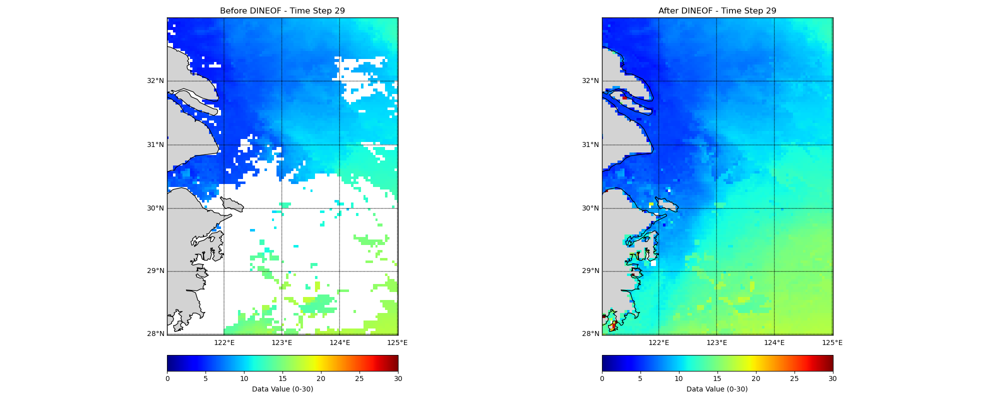

# DINEOF-Python

This Python implementation of the **DINEOF (Data Interpolating Empirical Orthogonal Functions)** algorithm is designed to handle the reconstruction of missing spatiotemporal data, particularly useful for oceanographic datasets such as chlorophyll-a concentration and sea surface temperature. The method efficiently fills data gaps using EOF analysis, and it includes a **Monte Carlo validation loop** for optimizing the model and error estimation.

## Overview
### :rocket: **The project aims to make DINEOF more accessible to Python users while retaining the rigor and reliability of the original method.**

The code is **Inspired By** the original MATLAB scripts provided by **Aida Alvera-Azcárate** (available at [MATLAB Scripts](https://github.com/aida-alvera/DINEOF/tree/master/Scripts/Matlab)) and builds upon the concepts presented in the **DINEOF.pdf** document.

## Key Features of the Python Implementation:
- **Reconstructs Missing Data**: The algorithm reconstructs missing data in large spatiotemporal datasets, filling gaps based on empirical orthogonal function (EOF) decomposition.
- **EOF Analysis**: The missing data is estimated using EOFs (Empirical Orthogonal Functions) to analyze the spatial and temporal patterns of variability. The number of EOFs used for reconstruction is selected based on the cumulative variance explained.
- **Monte Carlo Validation Loop**: A Monte Carlo validation loop is employed to randomly select subsets of the data for training and testing. This allows the algorithm to be validated and tuned for optimal performance. The best model is selected based on the lowest validation error.
- **Data Normalization and Denormalization**: The code normalizes the data to facilitate more efficient processing and then denormalizes the data after filling the missing values to restore the original scale.
- **Visualization**: The code includes visualization capabilities to compare the original data and the reconstructed data (before and after DINEOF) using geographic mapping, allowing for easy comparison of the interpolation results across time steps.

## :star: Features
- Reconstruction of missing spatiotemporal data using DINEOF.
- Monte Carlo validation for optimizing EOF selection and estimating model errors.
- Visualization.

## Main Script
The main script for running the DINEOF algorithm is `DINEOF_MAIN_edtor.py`. This script loads the dataset, applies the DINEOF algorithm, and outputs the reconstructed data. Functions for data processing, validation, and EOF computation are located in the `utils.py` .

### Example: Before and After DINEOF Reconstruction

## Contact
If you have any questions, feel free to contact: 'zhouweichen1992110@outlook.com'

## License
Licensed under a [Creative Commons Attribution-NonCommercial 4.0 International](https://creativecommons.org/licenses/by-nc/4.0/) for Non-commercial use only.
Any commercial use should get formal permission first.

## Acknowledgments
This code is **based on the MATLAB scripts publicly provided by **shepherdmeng** [MATLAB code](https://github.com/aida-alvera/DINEOF/tree/master/Scripts/Matlab](https://github.com/shepherdmeng/Image-Data-Reconstruction-with-DINEOF)). It also references the methodologies outlined in:
- Beckers, J.M., Rixen, M., 2003. *EOF calculations and data filling from incomplete oceanographic datasets*. Journal of Atmospheric & Oceanic Technology, 20.
- Alvera-Azcárate, A., et al., 2007. *Multivariate reconstruction of missing data in sea surface temperature, chlorophyll, and wind satellite fields*. Journal of Geophysical Research, 112.

